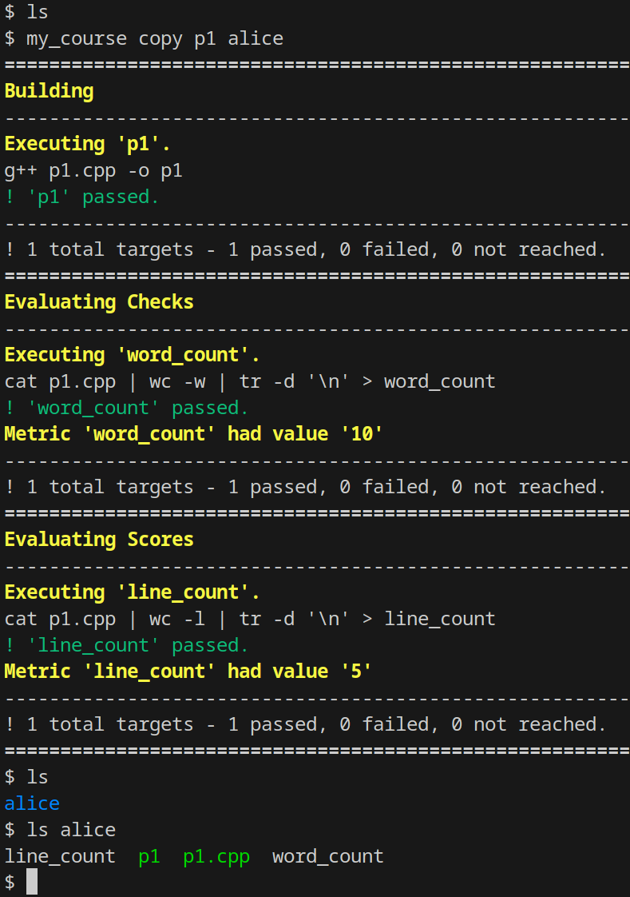
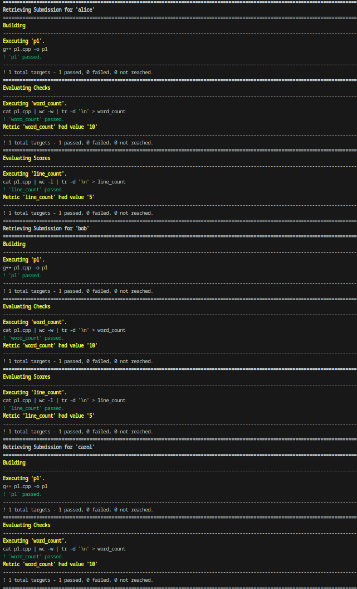
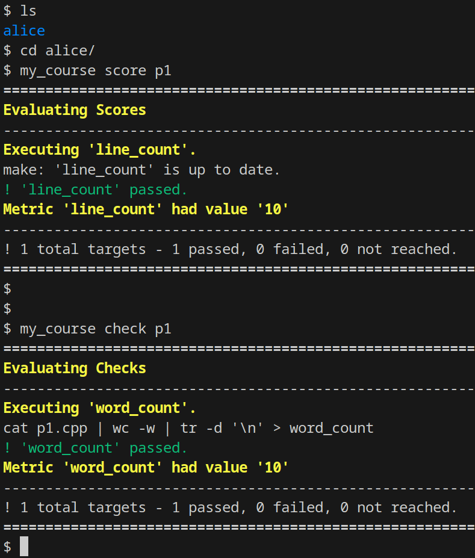
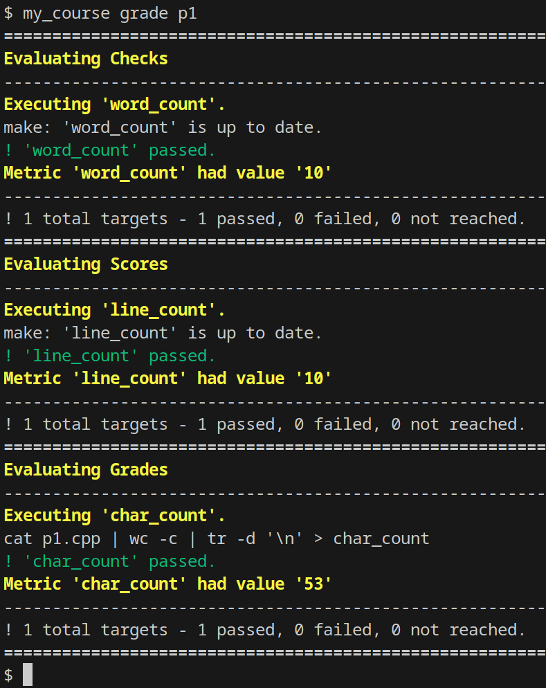

# **`asgn`** for Graders

If you are a grader, be sure to review the [subchapter for students](./students.md), since you also have access to all student-related functionality.

## Retrieving Submissions

The **copy** sub-command will retrieve the submission of a particular student for a particular assignment:

This retrieval only copies the set of files on the assignments list, but whatever building/metrics that are run on submission are repeated on the newly retrieved copies.
This is done to ensure no tampering in the submission directory (students manually moving files in and out) will affect the apparent quality of the submission.

The **copy_all** sub-command will retrieve the submission of all students for a particular assignment.
Like **copy**, the automation performed upon submission is also replicated for each submission:

## Evaluating Metrics

The **scores** and **checks** of an assignment can be run on a submission at any time by using the **score** and **check** sub-commands:

In addition to scores and checks, assignments may also be given additional metrics called **grades**, which are only accessible by graders.
These metrics may be evaluated using the **grade** sub-command.

If an instructor chooses, they may have scores and checks evaluated in addition to grades as part of this subcommand:

