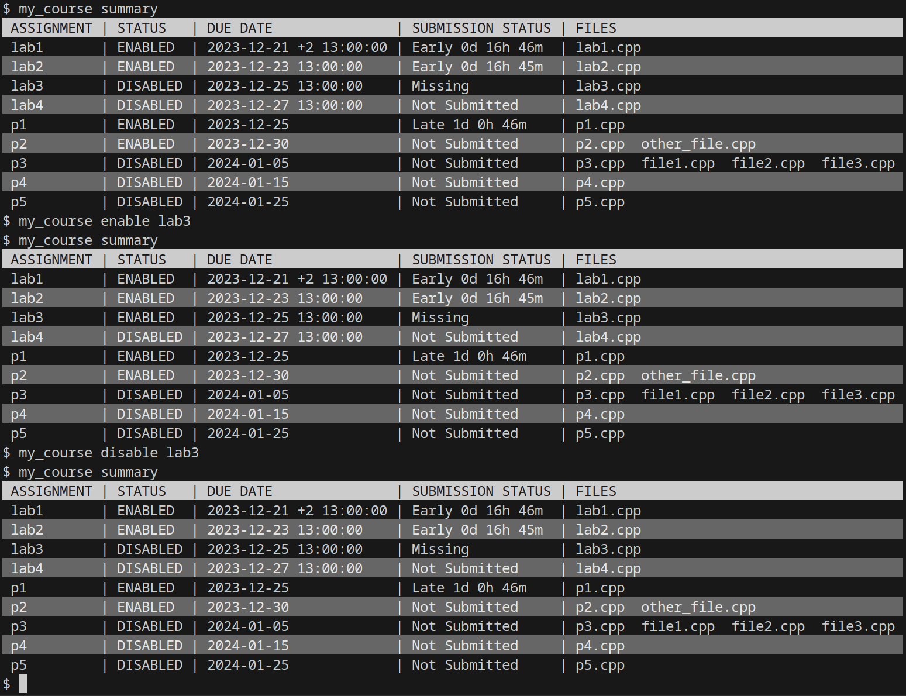
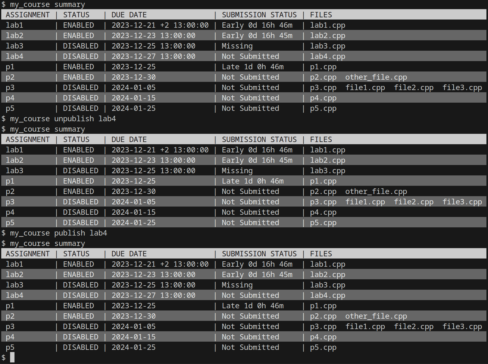
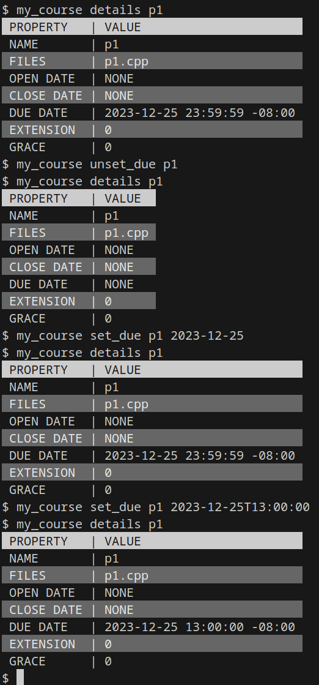

# Managing Assignments

## Controlling Assignment Accessibility/Visibility





## Setting Open/Close/Due Dates



## Automating Score Updates

If you plan to use scores heavily in your course, you and your students will likely desire quick feedback between someone running the `submit` subcommand and seeing an update in the published rankings.

Out of the box, `asgn` does not provide automated ranking updates.
However, you can easily establish ranking updates with `crontab`.

To do so, open your `crontab` file with this command:

```console
crontab -e
```

Once it has been opened, add in the appropriate `update_ranks`/`update_all_ranks` command, prepended with an appropriate periodicity [according to the `cron` format](https://www.man7.org/linux/man-pages/man5/crontab.5.html).
Here's an example `crontab` file snippet, with two different periodic ranking updates:

```
# Update all rankings on an hourly basis, appending stdout/stderr to a log file
0 * * * * my_course update_all_scores &>> ~/ranking_log
# Update the rankings of assignment "hackathon" on a minute-by-minute basis, but don't log any output
* * * * * my_course update_scores hackathon
```

