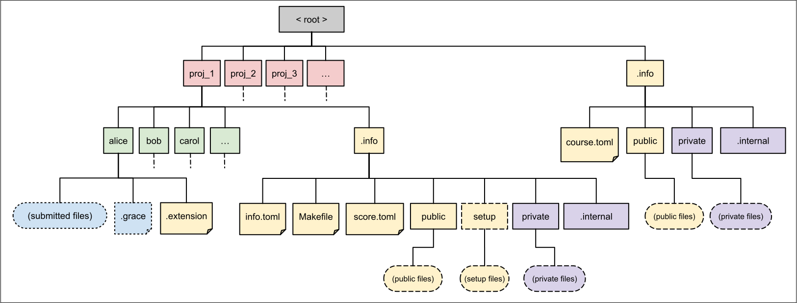

# **`asgn`** for Instructors

If you are an instructor, be sure to review the [subchapter for students](../students.md) and the [subchapter for graders](../graders.md), since you also have access to all student/grader-related functionality.


This initial chapter covers the general principles of operation that govern how **`asgn`** works.
Later chapters will cover setup, sub-commands, and other topics.

## The Directory Structure

**`asgn`** uses a directory structure to organize information about courses.
Below is a diagram of how a course's directory structure is laid out.




### Assignment and Submission Directories

Every assignment within a course should have a directory with a matching name in the root directory of that course (shown in red in the diagram).
Likewise, every member of the course (student/grader/instructor) should have a directory with a matching name in each assignment directory (shown in green on the diagram).
These member directories store the files submitted by users as well as data storing the extensions applied to that submission.

### The Top-Level **`.info`** Directory

Within the root directory is an **`.info`** directory.
This directory stores a **`course.toml`** file which stores information about the course, including a list of students (as usernames), a list of graders (also usernames), and a list of assignments.
All assignments listed by the **`course.toml`** should have matching assignment directories, and all members listed by the **`course.toml`** should have matching submission directories.

In addition to the **`course.toml`** file, this topmost **`.info`** directory should have a **`public`** directory, a **`private`** directory, and an **`.internal`** directory.
The **`public`** directory is accessible by all users, and is meant to store additional files that need to be accessed by student accounts when running **`asgn`**.
Likewise, the **`private`** directory is accessible only to graders and the instructor, and is meant to store additional files that need to be accessed when running restricted features of **`asgn`**.
The **`.internal`** directory is meant for internal use by **`asgn`**, and its contents don't usually need to be viewed or modified.

### Per-Assignment **`.info`** Directories

Within each assignment directory is another **`.info`** directory which stores per-assignment files and configurations.
Information about the corresponding assignment (name, due date, files for submission, etc) is stored by the **`info.toml`** within this directory.
This directory also contains **`public`**/**`private`**/**`.internal`** directories that serve similar purposes to those in the top-level **`.info`** directory.

There is also a **`Makefile`**, which is used to define the automated building/metrics for the assignment.
When an instructor evaluates the scores of students, those scores are stored in the **`score.toml`** file.
If a directory named **`setup`** is added by the instructor, the files within that directory will be served to students as the setup files for that assignment.

### Permissions

The majority of files/directories shown in the diagram above should be writable by the instructor and readable+executable to everyone.
This is done because each of these files/directories, through both their existence and content, express information that everyone should know but which should be alterable only be the instructor.
There are two major exceptions to this rule.

First, the **`private`** and **`.internal`** directories used by **`asgn`** are only readable to instructors and graders.
This is done since, by their very nature, they should not be inspected by students.

Second, each student can read and write to their submission directories, but they cannot read and write to the submission directories of other course members.
This is done to protect student information as well as to prevent tampering with other student's submissions.
Notably, the **`.extension`** file within each submission directory is **not** modifiable by the corresponding student, since extensions are at the sole discretion of the course's instructor.
Of course, to make grading possible, graders may read from any submission directory, but only instructors may modify the content of submission directories (aside from the students themselves).
As with many other design decisions, this is done to avoid accidental data loss.


## The **`course.toml`** File

Here is an example **`course.toml`** file:

```toml
manifest = ["lab1", "lab2", "lab3", "lab4", "lab5", "p1", "p2", "p3", "p4", "p5"]
graders = ["xavier", "yolanda", "zelda"]
students = ["alice", "bob", "carol"]
grace_total = 5
grace_limit = 2
```

- The **manifest** field lists all assignments in the course.
- The **graders** field lists all graders in the course.
- The **students** field lists all students in the course.
- The **grace_total** field indicates the total number of grace days each student is allotted. This value is optional. If this value is not included, it defaults to no grace days.
- The **grace_limit** field indicates the maximum number of grace days a student may spend on any one assignment. This value is optional. If this value is not included, any number of grace days (up to the number remaining) may be used.

## Assignment **`info.toml`** Files

Here is an example **`info.toml`** file:

```toml
name = "project_1"
active = true
visible = true
due_date = 2023-12-25
open_date = 2023-12-01T12:00:00
close_date = 2023-12-26T12:00:00
file_list = ["p1.cpp","p1_test.cpp"]

[build]
on_submit=false
on_grade=true
[[build.rules]]
target="program"
wait_text="Building executable..."
pass_text="Executable successfully built"
fail_text="Build failed."
help_text="Make sure that all functionality is contained within 'p1.cpp'"
[[build.rules]]
target="tests"


[score]
[[score.rules]]
target="line_count"
kind="int"
fail_okay=true
[[score.rules]]
target="word_count"
kind="int"
fail_okay=true


[check]
[[check.rules]]
target="says_tomato"
kind="bool"
fail_okay=true
[[check.rules]]
target="says_potato"
kind="bool"
fail_okay=true

[grade]
[[grade.rules]]
target="char_count"
kind="int"
fail_okay=true
```

- The **name** field must match the name of the corresponding assignment directory (and hence the name in **`course.toml`**). This is done to avoid assignment config files being dropped into the wrong assignment directory without being noticed.
- The **active** field indicates whether students should be able to interact with the assignment (setup, submit, etc)
- The **visible** field indicates whether students should be able to see the assignment via the **summary** subcommand
- The **file_list** field indicates the set of files that are expected for a submission to be valid. All files in the list must be present in the user's working directory and must be successfully copied to the submission directory for the submission to be considered successful.
- The **due_date** field indicates when the assignment is due. This field is optional.
- The **open_date** field, if defined, makes the assignment inactive before the given date. This field is optional.
- The **close_date** field, if defined, makes the assignment inactive after the given date. This field is optional.


Building, scores, checks, and grades are each defined as a **ruleset**, respectively called **build**, **score**, **check**, and **grade**.

A ruleset consists of the following (optional) fields:
- **on_grade** - Indicates whether the ruleset should be run as part of the **grade** subcommand. Defaults to **true**.
- **on_submit** - Indicates whether the ruleset should be run as part of the **submit** subcommand. Defaults to **true**.
- **fail_okay** - Indicates whether the ruleset should continue past failures. Defaults to **false**.
- **rules** - The list of rules corresponding to this ruleset. Defaults to **empty**.

Each ruleset can have zero or more **rules**. Each rule must have a defined **target** field, indicating the specific target to run in the assignment's Makefile. In addition, each rule has the following optional fields:
- **fail_okay** - Overrides the **fail_okay** field for the ruleset
- **wait_text** - Overrides the default text displayed just before executing the corresponding target
- **pass_text** - Overrides the default text displayed when the target runs successfully
- **fail_text** - Overrides the default text displayed when the target fails
- **help_text** - Defines additional "advice" text to display if the target fails.

If a ruleset corresponds with a set of metrics, a **kind** field must also be set to one of three string values:
- "bool"
- "int"
- "float"

This field indicates the type of the metric, and it must be defined in order to sort scores as part of rankings.

## Assignment Makefiles

An example assignment Makefile, matching the **`info.toml`** shown previously:

```makefile

program: p1
tests: p1_test

p1: p1.cpp
	g++ p1.cpp -o p1

p1_test: p1_test.cpp
	g++ p1_test.cpp $(PUBLIC)/buggy_p1.cpp -o p1_test
    $(COURSE_PUBLIC)/jail.sh ./p1_test

says_tomato: p1.cpp
	if grep 'tomato' p1.cpp; then echo -n "true">says_tomato; else echo -n "false">says_tomato; fi

says_potato: p1.cpp
	if grep 'potato' p1.cpp; then echo -n "true">says_potato; else echo -n "false">says_potato; fi

line_count: p1.cpp
	cat p1.cpp | wc -l | tr -d '\n' > line_count

word_count: p1.cpp
	cat p1.cpp | wc -w | tr -d '\n' > word_count

char_count: p1.cpp
	cat p1.cpp | wc -c | tr -d '\n' > char_count

```

When the target for a metric is ran, **`asgn`** expects the value of that metric to be written to a file with a matching name, with no trailing whitespace, in a format matching that metric's **kind** field.

When **`asgn`** runs a make target, it sets the following variables via arguments to the program:
- **`PUBLIC`** - Path to the assignment's **`public`** directory.
- **`PRIVATE`** - Path to the assignment's **`private`** directory.
- **`COURSE_PUBLIC`** - Path to the course's **`public`** directory.
- **`COURSE_PRIVATE`** - Path to the course's **`private`** directory.

These "built-in" variables, in combination with the presence of these directories, should to make it easy to organize the auxiliary files used to build and evaluate submissions.
Files that should be hidden from students (and which should not be accessed by any student sub-command) should be placed in a **`private`** directory.
Likewise, files that are to be shared across multiple assignment should be stored in the course's **`public`**/**`private`** directory.

