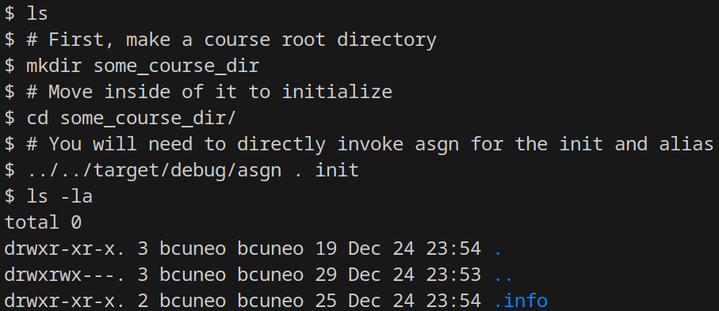
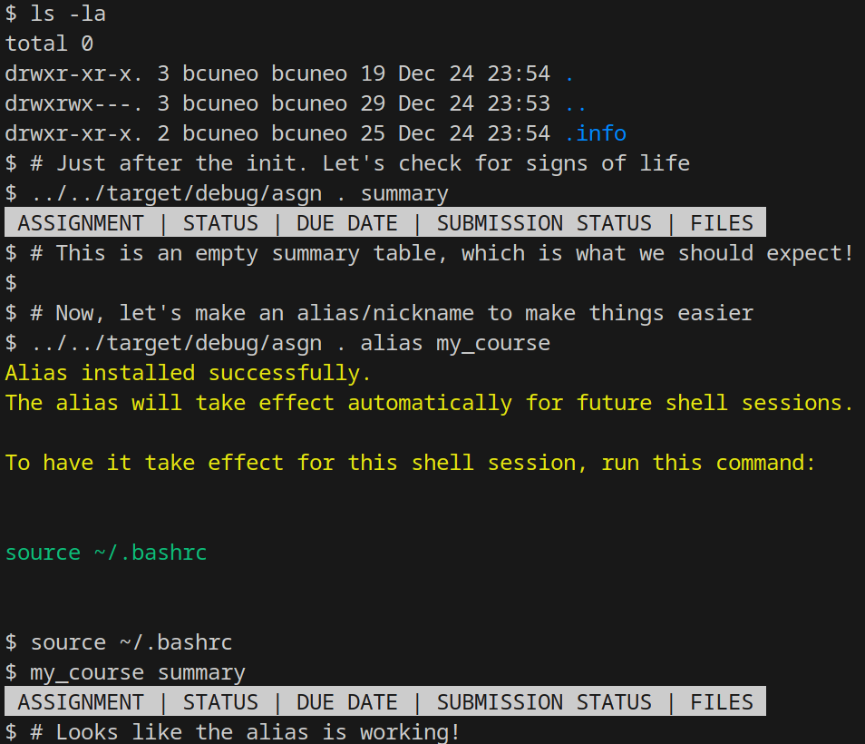
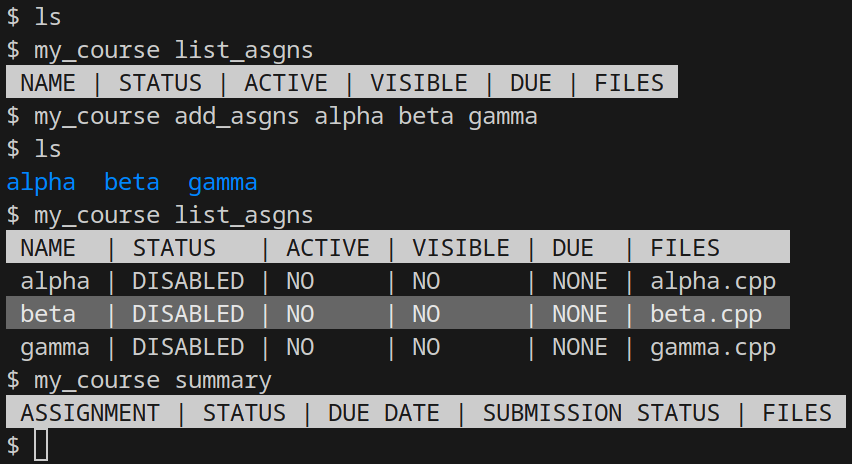
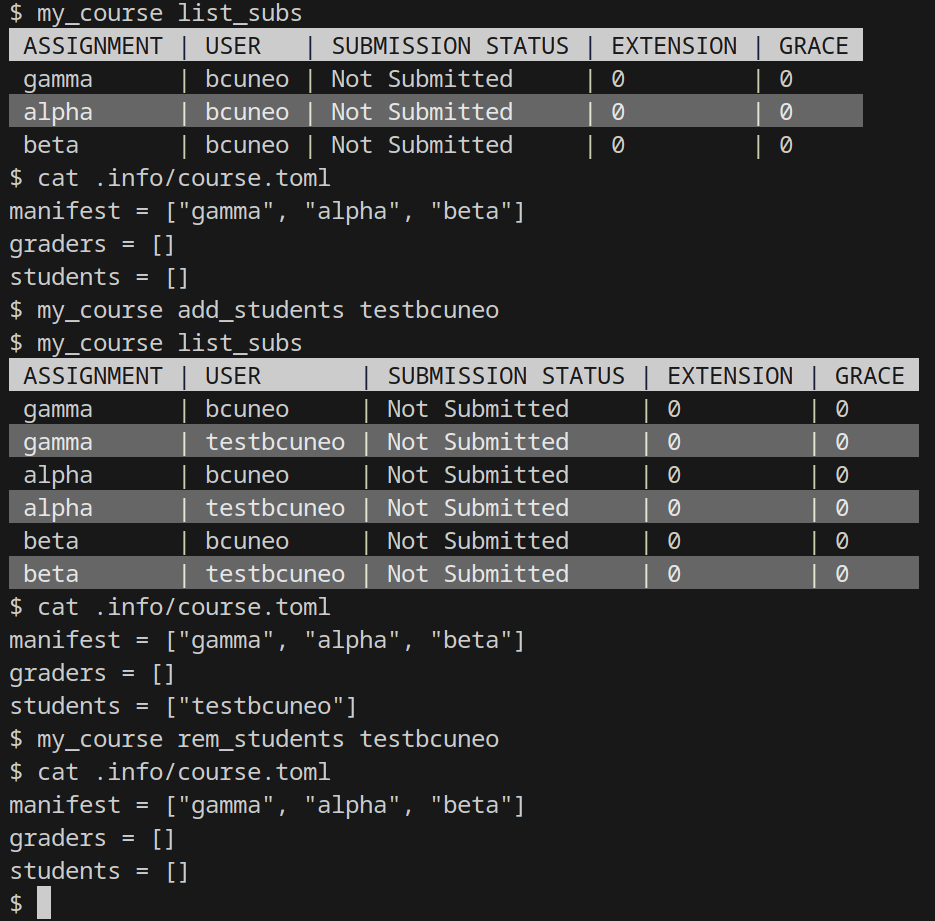
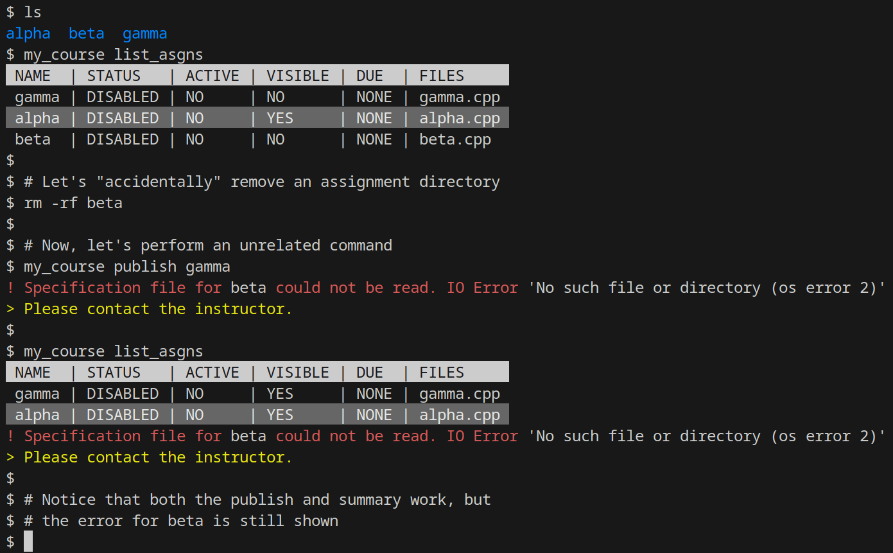

# Course Setup

## Your Best Friend : The **refresh** Sub-command

Before you even begin setting up your first course, it is good to be aware of the **refresh** sub-command.

The **refresh** sub-command is an indispensable tool for instructors manipulating an **`asgn`** course.
It requires no arguments and can be run as follows (assuming **my_course** is the relevant course nickname):

```
my_course refresh
```

This sub-command re-asserts the directory structure and file permissions of the corresponding course.

- Any assignments listed in the **`course.toml`** file which do not have a proper assignment directory is given one
- Any assignments missing an **`.info`** sub-directory is given one
- Any missing requisite files/directories in each **`.info`** sub-directory is created in a minimal default state.
- Any student/grader listed in the **`course.toml`** file (or the instructor themselves) which does not have a submission directory in any assignment directory is given one, and said directories are given a zeroed **`.extension`** file.
- As the presence of each requisite file/directory is checked, the permissions expected of that item are applied to that item.

Generally, if anything in the directory structure or its contents varies from the model described in the [overview sub-chapter](./main.md), it should be fixed.

**There is one important caveat:** The **refresh** sub-command will not delete any file or directory.
If there is a file where a directory should be or a directory where a file should be, the process terminates early and reports an error. This is done to avoid accidental data loss. However, if the directory structure is used correctly, this sort of name collision should not occur.


## Creating a New Course Directory

To begin, create and navigate to the base directory you wish to act as the root for your course.
From this directory, run the **init** sub-command to initialize the directory as an **`asgn`** course.
Since the course does not exist yet, we won't be able to use any course nickname yet.




This will simply create an **`.info`** directory with a default **`course.toml`**, then run a **`refresh`**.
Once this is complete, the course will look bare, but **`asgn`** should not complain about the course not existing.
To make subsequent manipulations easier, it is best to establish a nickname right after establishing the root.



The rest of this guide will assume you have done so, and will continue to use the "**my_course**" nickname used in other sub-chapters.


## Adding/Removing Assignments to the Course

Assignments can be added by simply adding them to the manifest in the **`course.toml`** file, then running **refresh**.
Alternatively, if you don't want to dig around for that toml file, you can run the **add_asgns** sub-command, which does this automatically.




Assignments may be removed from the manifest by removing them from the **`course.toml`** file or running the **rem_asgns** sub-command.
Because **`asgn`** is designed to avoid accidental data loss, neither of these actions will remove any files or directories, they will simply prevent **`asgn`** from recognizing the corresponding assignment names as valid.
Unless you plan on manually cleaning out these assignment directories, it is not recommended that you re-use the same root directory across multiple iterations of a course, as the directory structure will accumulate clutter over time.


## Adding/Removing Students/Graders to the Course

Much like assignments, students and graders can be added by simply adding them to the corresponding list in the **`course.toml`** file, then running **refresh**.
Again, much like assignments, these actions are automated through the **add_students** or **add_graders** sub-commands, which do this automatically.




Students and graders may be removed by removing them from the **`course.toml`** file or running the **rem_students** or **rem_graders** sub-commands.
Yet again, much like with assignments, this will not remove any submission directories or delete any files.


## Copying in an Assignment from a Different Course

The directory structure of **`asgn`** is designed to make the transference of assignment info relatively painless.
Simply create a new assignment through the steps described previously, then overwrite the newly created default **`.info`** directory with the **`.info`** directory of the desired assignment.
Generally speaking, if all dependencies are contained with the **`public`** and **`private`** directories of the **`.info`** directory, copying the directory should cleanly transfer all original functionality to the new course.

If you plan on using the course-wide **`public`** and **`private`** directories, it is advised to organize them so that functionally independent files can be transferred to other courses easily.


## Your Other Best Friend : Assignment Load Error Reporting

Whenever **`asgn`** is run (unless it is the **`init`** sub-command), it attempts to load the **`course.toml`** file, then to load the **`info.toml`** file for every assignment it lists.



If a non-instructor runs **`asgn`**, none of the failed assignment loads are reported unless it is involved in an error directly related to the corresponding sub-command.
However, when an instructor runs **`asgn`**, every single one of these errors is reported.
While this can be surprising at times, it means that any issues significant enough to prevent an assignment from loading should be reported as soon as your first **`asgn`** action.

