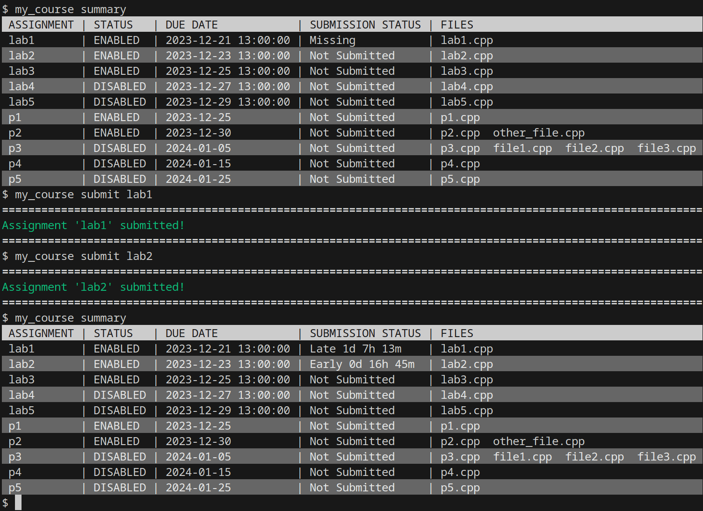

# **`asgn`** for Students

## Getting Started

Before anything else, you will want to create a "nickname" for running your instructor's `asgn` executable on your course's submission directory.
The exact command to do this must be provided by your instructor, so check your course materials or ask your instructor for that command.

Here is the general pattern that command will follow:

```
<asgn path> <course path> alias <nickname>
```

Once that is complete, you can use that nickname to use the sub-commands that are detailed below.

The nickname you will use will change between courses.
To keep the example commands intuitive, this guide will use **my_course** as the nickname.

Here is an example of one potential use of the **alias** sub-command:


_Note that the **my_course** alias is not active until the alias sub-command has been run **and** **`~/.bashrc`** has been sourced._

## Viewing Course Information

To get an overview of the course, use the **summary** sub-command, like so:

```console
my_course summary
```

This sub-command should print a table of published assignments, as well as high-level information about said assignments.
Here is an example of one possible **summary** output:


## Due Dates

The **due date** of an assignment indicates the time that an assignment should be turned in by.
If only a date is shown (not a specific time of day), then all submissions made at or before 23:59:59 (aka 11:59:59 PM) of that day will be marked as on-time or early.



### Extensions

Specific students may be granted integer-day extensions for specific assignments at the discretion of the instructor.
If you have been granted an extension for a specific assignment, the due date will be annotated with an addition corresponding to the number of days in the extension.


*The previously shown summary, but with a one-day extension applied to lab1 and lab2*


*The previously shown summary, but with a two-day extension applied to lab1 and lab2*


### Grace Days

At the discretion of the instructor, the students of a course may be granted a bank of **grace days**.
Grace days are at-will extensions applied by students to their own assignments.

If an instructor elects to provide grace days for a course, the **summary** sub-command should display the total number of grace days provided per-student, the maximum number of grace days that may be spent per-assignment, and the total number of grace days spent.

If an instructor elects to provide grace days, the number of grace days used on a particular assignment may be set with the **grace** sub-command, like so:


## Viewing Assignment Details

Not all information about each assignment is shown by the **summary** sub-command.
For example, the addition shown in an assignment's due date is the sum of extension and grace days - meaning that it may not be clear what proportion of a deadline's extension is due to grace days or due to instructor intervention.
Additionally, an instructor may set open dates and close dates to limit the range of times an assignment is available, and these dates are not shown by the **summary** sub-command.

These additional details can be seen via the **details** sub-command:


## Retrieving Setup Files

At the instructor's discretion, setup files may be provided for an assignment through **`asgn`**.
If this is the case, the setup files may be retrieved via the **setup** sub-command:


## Submitting Assignments

Each assignment is given a list of file names which are expected during submission.
The **submit** sub-command checks whether all of these files are present in the current working directory, copying each file in that list to a designated submission directory.
If any of these files do not exist, or if **`asgn`** encounters an error when copying over files, it will report these issues.
If not, the sub-command should report that the assignment was submitted successfully.


### Automated Builds

At the instructor's discretion, the compilation of a submitted assignment may be tested during submission.
If this is the case, parts of the build process, as well as their results will be ran and shown upon submission:


### Automated Metrics

At the instructor's discretion, some automated metrics may be evaluated for submitted assignments.

The two types of automated metrics visible to students are **checks** and **scores**.
If they are provided, these metrics will be shown much like an automated build, but the results of the checks/scores will be displayed as a table, like so:


While **checks** are private, **scores** may be posted to a public course-wide ranking.
To prevent tampering, only scores evaluated by the instructor will be posted to this ranking.
As a result __the scores you see when you submit an assignment will not be posted to this ranking__.


## Recovering the Latest Assignment Submission

The most recent submission for an assignment may be recovered from the submission directory using the **recover** sub-command, like so:


Each call to **recover** will create a new directory.
If a pre-existing **recover** directory is in the current working directory, a unique integer is added to the end of the new directory's name.

